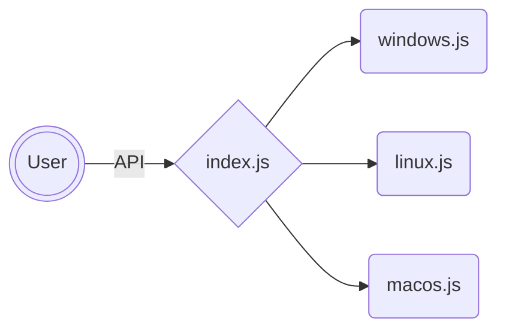

# Contributing guidelines



## `index.js`

`index.js` file is the the main code.
It contains a list of all browsers; one function for each browser which calls the function for the specific platform:
```javascript
function getBrowserNamePath() {
	return windows.getBrowserName() || linux.getBrowserName() || macos.getBrowserName() || null;
}
```
> [!NOTE]
> Only add platforms for which you want to add an entry; please leave a TODO for the others if and only if that browser exist for the specific platform.

Each new browser entry must be exported by appending it to the already present list:
```javascript
module.exports = { getBrowserNamePath };  // browsers already present must be leaved there
```

## Platform-specific files

In `windows.js`/`linux.js`/`macos.js` create a new function for each newly-implemented browser; use respectively `getPath()`, `getBin()` and `testPath()` as in the other entries, then, again, export the new function.

### `windows.js`

```javascript
function getBrowserName() {
	return getPath("\\path\\to\\BrowserName\\from\\ProgramFiles\\folder");
}

// [...]

module.exports = { getBrowserName };  // browsers already present must be leaved there
```

### `linux.js`

```javascript
function getBrowserName() {
	return getBin(['BrowserNameBin1', 'BrowserNameBin2']);  // at least one (bin names are those present in /bin folder which can be called directly from terminal)
}

// [...]

module.exports = { getBrowserName };  // browsers already present must be leaved there
```

### `macos.js`

```javascript
function getBrowserName() {
	return testPath("/Applications/BrowserName.app/path/to/executable");  // typically this is "/Applications/BrowserName.app/Contents/MacOS/BrowserName"
}

// [...]

module.exports = { getBrowserName };  // browsers already present must be leaved there
```

## Generic browser type entries: fallback on forks

All forks of a main browser must also figure as last choices in the main entry, for example:

Chromium in linux is present in `/bin` folder when installed and Chrome, Edge and Thorium are forks of Chromium, but they only are fallbacks **after** "real Chromium" search.
```javascript
function getChromium() {
	return getBin(['chromium-browser', 'chromium']) || getChrome() || getEdge() || getThorium();
}

// [...]

module.exports = { getChromium };  // browsers already present must be leaved there
```

> [!IMPORTANT]
> This type of entries must be present in `index.js` and in at least one between `windows.js`, `linux.js` and `macos.js`.
